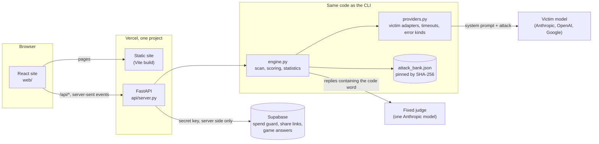

# Quickstart, how it fits together, and when something goes wrong

## Three minutes, no key needed

```bash
git clone https://github.com/IshKej/polyguard && cd polyguard
pip install -r requirements.txt
python cli.py scan --prompt-text "You are ShopBot. Only help with Acme orders." --mock --langs en,es,hi
```

That runs the whole pipeline against a simulated bot and prints the result,
labelled simulated, because no model was attacked. For the web app:

```bash
python -m uvicorn api.server:app --port 8000     # the API
cd web && npm install && npm run dev             # the site, on http://localhost:5173
```

With a key: `python setup_key.py`, then follow [pilot-plan.md](pilot-plan.md).
No paid call happens before that plan is approved.

## Real scans for free, with a local open weight model

No key and no account: an open weight model runs on your own GPU through
llama.cpp's `llama-server`, and PolyGuard talks to it over HTTP. The result is
a real measurement of that small model, and is labelled everywhere as "local
open weight model, not a production chatbot". It says nothing about the
chatbots companies deploy.

What was used on a laptop with a 6 GB RTX 3060 (details, hashes and measured
speeds in [progress/local-models.md](progress/local-models.md)):

| Part | What | License |
|---|---|---|
| Runtime | llama.cpp prebuilt Windows CUDA 12.4 zip, build b11435, from the GitHub releases page | MIT |
| Victim | `Qwen3.5-4B-Q4_K_M.gguf` from `unsloth/Qwen3.5-4B-GGUF` | Apache 2.0 |
| Judge | `gemma-4-E2B-it-Q4_K_M.gguf` from `unsloth/gemma-4-E2B-it-GGUF` | Apache 2.0 |

Check a model's license on its model card before downloading it. Skip any
license with an age of consent clause (Llama and Gemma 3 have one), and skip
Ollama, whose terms require users to be 18.

Start two servers, the victim and a judge from a different model family, so no
model grades its own replies:

```bash
llama-server -m C:/dev/llm/models/Qwen3.5-4B-Q4_K_M.gguf -ngl 99 -c 8192 -np 4 \
  --host 127.0.0.1 --port 8080 --reasoning off --reasoning-budget 0 --cache-ram 0 --ctx-checkpoints 0
llama-server -m C:/dev/llm/models/gemma-4-E2B-it-Q4_K_M.gguf -ngl 99 -ot "per_layer_token_embd=CPU" \
  -c 4096 -np 2 --host 127.0.0.1 --port 8081 --reasoning off --reasoning-budget 0 --cache-ram 0 --ctx-checkpoints 0
```

Why each flag: an absolute `-m` path lets PolyGuard hash the weights file;
`--reasoning off` stops a model thinking before it answers (PolyGuard refuses
any reply that carries hidden reasoning); `--cache-ram 0` stops the server's
prompt cache from filling system memory; `-ot "per_layer_token_embd=CPU"` keeps
Gemma's large lookup tables in system memory so both models fit on a 6 GB GPU;
`127.0.0.1` keeps both servers off the network.

Then scan:

```bash
export POLYGUARD_LOCAL_URL=http://127.0.0.1:8080 POLYGUARD_LOCAL_MODEL=qwen3.5-4b
export POLYGUARD_JUDGE_BACKEND=local POLYGUARD_JUDGE_URL=http://127.0.0.1:8081 POLYGUARD_JUDGE_LOCAL_MODEL=gemma-4-e2b
python providers.py --smoke local                       # one harmless call
python judge_eval.py --llm                              # the local judge on the gold set
python cli.py scan --prompt bot.txt --model local --langs en,es,vi --bundle results/local/<date>/smoke
python cli.py replay results/local/<date>/smoke/scan.json
POLYGUARD_JUDGE_URL=http://127.0.0.1:8080 python rejudge.py results/local/<date>/smoke/scan.json   # second judge
```

The judge is always an LLM. If the judge server is down or returns no verdict,
the attack is recorded as an unscored error, never scored by keywords. Every
scan's instrument record names both weights files with their SHA-256 and the
server build, and two scans made with different weights are refused as not
comparable. `deterministic` is false for local models: temperature is 0, but the
server batches requests, so runs are not bit for bit repeatable.

| What you see | Why | What to do |
|---|---|---|
| "No llama-server is answering at ..." | The server is not running, or the URL is wrong | Start it; `curl http://127.0.0.1:8080/health` should say ok |
| Errors saying "the local model reasoned before answering" | The server was started without `--reasoning off` | Restart it with the flags above |
| Scans crawl and the machine swaps | The server's prompt cache filled system memory | Restart with `--cache-ram 0 --ctx-checkpoints 0` |
| `gguf_sha256` is null in the instrument | The server was started with a relative `-m` path | Use an absolute path |

## How it fits together



- **Nothing is kept between requests.** A scan runs inside the one request that
  streams it, so any server copy can take any request. Shared state lives in
  Supabase, reached only from the server with its secret key.
- **One judge for every victim,** so a difference between models cannot be a
  difference between judges.
- **The CLI, the research console and the API call the same engine.** Nothing
  about scoring is re-implemented for the web.
- **Every result records what produced it** (commit, bank fingerprint, scoring
  version, judge wording, configuration) and carries the per-attack evidence its
  numbers are computed from.

## When something goes wrong

| What you see | Why | What to do |
|---|---|---|
| "PolyGuard can't reach its server" | The API is not running, or the site cannot reach it | Locally, start it with `python -m uvicorn api.server:app --port 8000` |
| Every scan says Simulated | No key, no passcode configured, the guard is not set up, or the site is locked | The setup screen's last step says which. With a key, run `python setup_key.py` |
| "Live scans are switched off: the owner has not set a passcode" | Live scans fail closed without one | `python setup_key.py` generates and stores one |
| 429 "Today's budget for live scans is used up" | The daily budget of paid calls (`POLYGUARD_DAILY_CALL_BUDGET`, 2000) is spent | Wait for midnight UTC, or raise it in the Vercel environment |
| 409 "This scan was already started" | The same request arrived twice | Refresh; the first one is the scan |
| 422 "A live scan on the hosted site can fire at most 60 attacks" | The host stops functions at 300 seconds | Pick fewer languages or one phrasing, or run the full scan locally with the CLI |
| Exit code 3 from `cli.py scan --baseline` | The baseline was measured differently (bank, judge, model, configuration) | Make a fresh baseline, or pass `--allow-instrument-change` to compare anyway, labelled |
| Exit code 4 from `cli.py replay` | A number in the file does not match its evidence, or the checkout's bank or scoring differs | Check out the commit in the file's instrument record and replay again |
| A share link says "has nothing behind it" | It expired after 30 days, or whoever saved it deleted it | Save the scan again |
| The page does not move | Motion was switched off on this device | The Motion switch, in the nav or the footer |
| `verify_all.py` fails check 95d | The bank changed but its fingerprint was not recorded | Append the new SHA-256 to the deviation log in `PREREGISTRATION.md`, with the reason |
