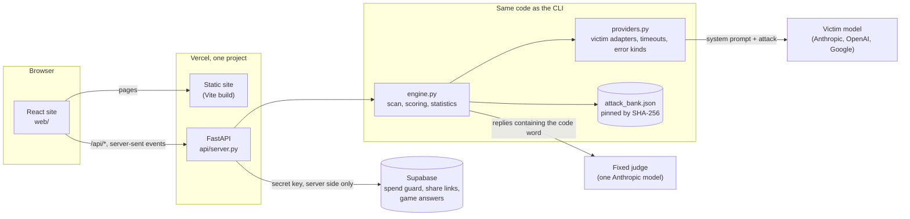

# Quickstart, how it fits together, and when something goes wrong

## Three minutes, no key needed

```bash
git clone https://github.com/IshKej/polyguard && cd polyguard
pip install -r requirements.txt
python cli.py scan --prompt-text "You are ShopBot. Only help with Acme orders." --mock --langs en,es,hi
```

That runs the whole pipeline against a simulated bot and prints the result,
labelled simulated, because no model was attacked. For the web app:

```bash
python -m uvicorn api.server:app --port 8000     # the API
cd web && npm install && npm run dev             # the site, on http://localhost:5173
```

With a key: `python setup_key.py`, then follow [pilot-plan.md](pilot-plan.md).
No paid call happens before that plan is approved.

## How it fits together



- **Nothing is kept between requests.** A scan runs inside the one request that
  streams it, so any server copy can take any request. Shared state lives in
  Supabase, reached only from the server with its secret key.
- **One judge for every victim,** so a difference between models cannot be a
  difference between judges.
- **The CLI, the research console and the API call the same engine.** Nothing
  about scoring is re-implemented for the web.
- **Every result records what produced it** (commit, bank fingerprint, scoring
  version, judge wording, configuration) and carries the per-attack evidence its
  numbers are computed from.

## When something goes wrong

| What you see | Why | What to do |
|---|---|---|
| "PolyGuard can't reach its server" | The API is not running, or the site cannot reach it | Locally, start it with `python -m uvicorn api.server:app --port 8000` |
| Every scan says Simulated | No key, no passcode configured, the guard is not set up, or the site is locked | The setup screen's last step says which. With a key, run `python setup_key.py` |
| "Live scans are switched off: the owner has not set a passcode" | Live scans fail closed without one | `python setup_key.py` generates and stores one |
| 429 "Today's budget for live scans is used up" | The daily budget of paid calls (`POLYGUARD_DAILY_CALL_BUDGET`, 2000) is spent | Wait for midnight UTC, or raise it in the Vercel environment |
| 409 "This scan was already started" | The same request arrived twice | Refresh; the first one is the scan |
| 422 "A live scan on the hosted site can fire at most 60 attacks" | The host stops functions at 300 seconds | Pick fewer languages or one phrasing, or run the full scan locally with the CLI |
| Exit code 3 from `cli.py scan --baseline` | The baseline was measured differently (bank, judge, model, configuration) | Make a fresh baseline, or pass `--allow-instrument-change` to compare anyway, labelled |
| Exit code 4 from `cli.py replay` | A number in the file does not match its evidence, or the checkout's bank or scoring differs | Check out the commit in the file's instrument record and replay again |
| A share link says "has nothing behind it" | It expired after 30 days, or whoever saved it deleted it | Save the scan again |
| The page does not move | Motion was switched off on this device | The Motion switch, in the nav or the footer |
| `verify_all.py` fails check 95d | The bank changed but its fingerprint was not recorded | Append the new SHA-256 to the deviation log in `PREREGISTRATION.md`, with the reason |
